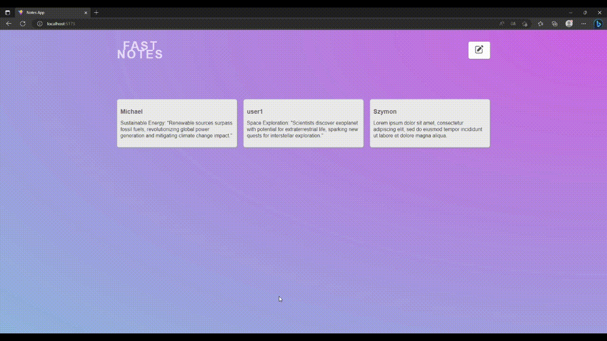

## Features

- Create a new note.
- View a list of all notes.
- View the details of an individual note.
- User-friendly and intuitive interface.
- Built with modern React.js with modular components.

## Requirements

- Node.js 12+
- npm/yarn
- React.js
- react-router-dom
- A running instance of the backend server

## Easy Installation & Setup

1. Clone the repository: 
    ```
    git clone https://github.com/Simon-zps/Fast-notes.git
    ```
2. Navigate to the cloned repository: 
    ```
    cd repository
    ```
3. Install the necessary packages: 
    ```
    npm install
    ```
4. Run the application: 
    ```
    npm start
    ```
